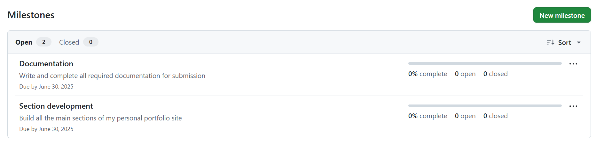
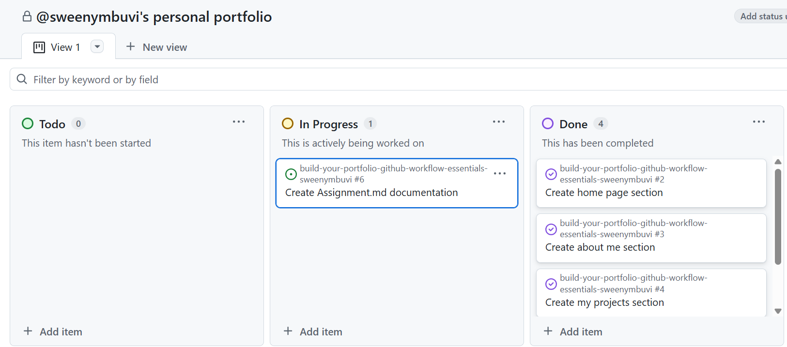
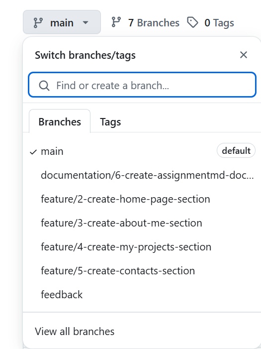
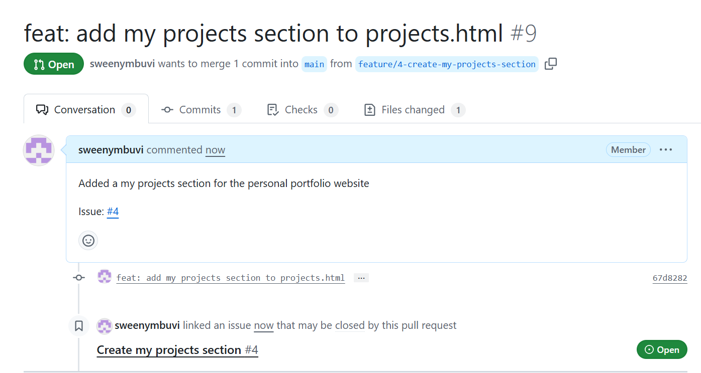

# Personal Portfolio Documentation

## 1. Student Details

- **Full Name**: Sweeny Kanini Mbuvi  
- **Admission Number**: 151422
- **GitHub Username**: sweenymbuvi  
- **Email**: sweeny.mbuvi@strathmore.edu

---

## 2. Deployed Portfolio Link

- **GitHub Pages URL**:  
 TO BE ADDED
---

## 3. Learnings from the Git Crash Program

### 🧠 What I Thought I'd Learn vs What I Actually Learned

**1. Concept: Commits and Commit Messages**

`Expectation 👀`: I thought committing was just saving changes — I didn’t think the message mattered much.

`Reality 😅`: I learned that writing meaningful commit messages using the correct types (`feat`, `fix`, `style`, etc.) helps keep the project organized and professional.

`Impact 💡`: I used clear and structured commit messages to track what I was changing in each part of my portfolio. It made it easier to go back and understand what I did.

---

**2. Concept: Branches**

`Expectation 👀`: I thought I could build everything directly on the main branch and that branching was optional for solo developers.

`Reality 😅`: I learned that working directly on main is risky — one mistake can break the entire site. Branches gave me a safe space to build and test each feature.

`Impact 💡`: I used branches to work on each section separately, which kept my main branch clean and stable.

---

**3. Concept: Milestones and Issues**

`Expectation 👀`: I thought milestones and issues were overcomplicated task lists that I wouldn't really use.

`Reality 😅`: They turned out to be great for planning. Issues helped me break down the project into clear tasks, and milestones helped me track progress.

`Impact 💡`: I used issues to track work on each page of the site, and milestones to group those tasks toward the finished website.

---

**4. Concept: Pull Requests**

`Expectation 👀`: I believed pull requests were just for team collaboration and code reviews by other people.

`Reality 😅`: Even working alone, PRs helped me review and test my work before merging. They also showed a clear history of my progress.

`Impact 💡`: I opened a pull request for each feature, linked them to their issues, and merged only after testing — just like in a real dev workflow.

---

## 4. Screenshots of Key GitHub Features

### A. Milestones and Issues

  
*Milestone and issues showing the breakdown of tasks.*

---

### B. Project Board

  
*Board with issues organized into To Do, In Progress, and Done.*

---

### C. Branching

  
*List of branches used in development (e.g., feature/home, feature/about).*

---

### D. Pull Requests

  
*A pull request linked to a specific issue and merged into main.*

---

